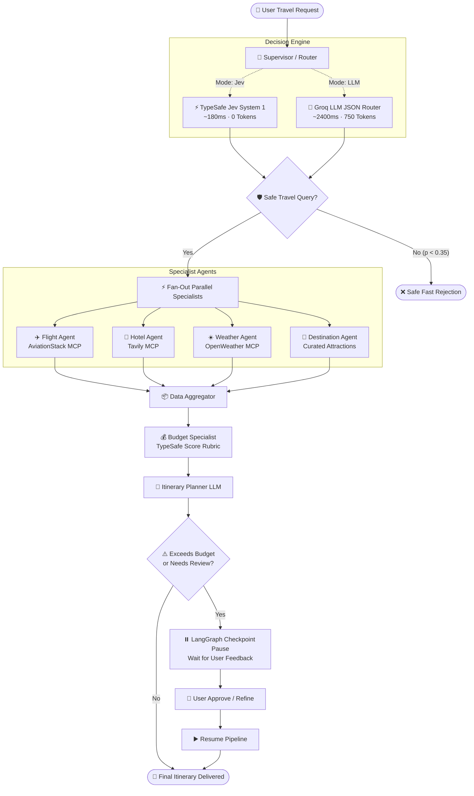

# ✈️ TripMate AI — Enterprise Multi-Agent Travel Planner

[](https://github.com/langchain-ai/langgraph)
[](https://typesafe.ai)
[](https://fastapi.tiangolo.com)
[](https://react.dev)
[](https://www.typescriptlang.org)
[](https://modelcontextprotocol.io)

**TripMate AI** is a state-of-the-art multi-agent travel intelligence system that combines **LangGraph stateful workflows**, **TypeSafe Jev System 1 calibrated decision models**, and **Groq LLMs** with real-world **Model Context Protocol (MCP v2)** tools to research, validate, budget, and synthesize personalized travel itineraries in seconds.

---

## 🌟 Key Features

- **⚡ Hybrid System 1 & 2 Architecture**:
  - **System 1 (TypeSafe Jev)**: High-speed, zero-token, probabilistic decisions (`Noul` guardrails, `Choice` routing, `Score` budget rubric) in **~180ms**.
  - **System 2 (Groq LLMs)**: Deep generative synthesis for complex day-by-day itineraries and personalized advice.
- **📊 Live Architecture Performance Benchmark**:
  - Side-by-side comparison between **TypeSafe Jev** (~180ms, 0 tokens) and **Pure LLM Prompt-and-Parse** (~2,400ms, 750 tokens).
  - Live latency gauges, token expenditure meters, and one-click architecture re-run toggle.
- **🤖 Autonomous Specialist Multi-Agent Team**:
  - **Supervisor / Router**: Evaluates safety guardrails and dispatches specialist tasks in parallel.
  - **Flight Specialist**: Queries live flight routes and schedules via AviationStack MCP.
  - **Hotel Specialist**: Searches verified accommodations, pricing, and ratings.
  - **Weather Specialist**: Fetches real-time destination forecasts and packing advice.
  - **Destination Specialist**: Discovers top attractions, local dining, and hidden gems.
  - **Budget Specialist**: Evaluates mathematical feasibility and flags cost overruns.
- **🛡️ Human-in-the-Loop (HITL) Checkpointing**:
  - LangGraph `MemorySaver` checkpointer pauses execution for user feedback when budgets exceed thresholds or user reviews are requested.
- **✨ Ultra-Modern Glassmorphic UI**:
  - Built with **React 19**, **Vite**, **TypeScript**, and custom Tailwind CSS design tokens.
  - Live execution timelines with millisecond badges, collapsible specialist findings, interactive day-by-day itinerary planner, and 12+ categorized complex trip inspiration presets.

---

## 🏗️ System Architecture



---

## ⚡ Performance Benchmark: Jev vs Pure LLM

| Metric / Dimension | ⚡ **TypeSafe Jev (Hybrid)** | 🤖 **Pure LLM (Prompt-and-Parse)** | Impact |
| :--- | :--- | :--- | :--- |
| **Supervisor Router Latency** | **~140 ms – 220 ms** | **~1,800 ms – 2,800 ms** | **⚡ 10–15× Faster** |
| **Tokens Consumed (Routing)** | **0 tokens** | **~680 – 850 tokens** | **💰 100% Token Savings** |
| **Type Safety & Reliability** | **100% Mathematical Probability** | **Prone to JSON Schema Failures** | **🛡️ Zero Parse Crashes** |
| **Guardrail Rejection** | **Instant filter before LLM call** | **Must load full LLM context** | **⚡ Zero-Token Filtering** |
| **Budget Feasibility** | **Calibrated `Score(0..100)` rubric** | **Uncalibrated text estimate** | **📈 Deterministic Scoring** |

---

## 📁 Repository Structure

```
trip-planner/
├── app.py                      # FastAPI web server, REST endpoints & SQLite persistence
├── backend.py                  # LangGraph multi-agent workflow, Jev decision models & prompts
├── database.py                 # SQLAlchemy database schema & thread migration helpers
├── mcp_client.py               # Model Context Protocol (MCP v2) client for external APIs
├── test_suite.py               # End-to-end multi-agent integration & latency tests
├── .env.example                # Example environment variables
│
└── frontend/                   # React 19 + TypeScript + Vite Web Application
    ├── src/
    │   ├── App.tsx             # Main dashboard layout & state orchestration
    │   ├── api.ts              # REST client for FastAPI endpoints
    │   ├── types.ts            # TypeScript interfaces & API response contracts
    │   ├── index.css           # Custom glassmorphic styles & design system
    │   └── components/
    │       ├── Header.tsx                  # App bar with status indicators & history toggle
    │       ├── TripInput.tsx               # Prompt input, mode switcher & 12+ inspiration presets
    │       ├── BenchmarkComparisonCard.tsx # Jev vs Pure LLM side-by-side benchmark card
    │       ├── AgentProgressTimeline.tsx   # Millisecond multi-agent execution timeline
    │       ├── JevDecisionCard.tsx         # System 1 calibrated probabilities & radar charts
    │       ├── HitlReviewCard.tsx          # Human-in-the-Loop review & resume modal
    │       ├── SpecialistResultsView.tsx   # Detailed tabs for Flights, Hotels, Weather & Budget
    │       ├── ItineraryViewer.tsx         # Day-by-day interactive itinerary cards
    │       └── PlanHistorySidebar.tsx      # Slide-over saved trip history drawer
    └── package.json
```

---

## 🚀 Quickstart & Setup Guide

### 1. Prerequisites
- **Python**: 3.11 or higher
- **Node.js**: v18.0 or higher
- **API Keys**:
  - [Groq API Key](https://console.groq.com) *(Required for LLM generation)*
  - [TypeSafe API Key](https://typesafe.ai) *(Required for Jev System 1 models)*
  - [Tavily Search API Key](https://tavily.com) *(Optional for live search tools)*
  - [AviationStack API Key](https://aviationstack.com) *(Optional for live flight data)*
  - [OpenWeather API Key](https://openweathermap.org) *(Optional for live forecasts)*

---

### 2. Backend Setup

```bash
# Clone the repository
git clone https://github.com/zainexperience2005/trip-planner.git
cd trip-planner

# Create and activate a Python virtual environment
python -m venv .venv
# On Windows:
.\.venv\Scripts\activate
# On macOS/Linux:
source .venv/bin/activate

# Install Python dependencies
pip install fastapi uvicorn langgraph langchain-groq langchain-typesafe httpx pydantic sqlalchemy python-dotenv

# Configure environment variables
cp .env.example .env
# Edit .env and insert your GROQ_API_KEY and TYPESAFE_API_KEY
```

Start the FastAPI server:
```bash
uvicorn app:app --reload --port 8000
```
Backend will be live at `http://127.0.0.1:8000` (Interactive API docs at `http://127.0.0.1:8000/docs`).

---

### 3. Frontend Setup

```bash
# Open a new terminal in the frontend directory
cd frontend

# Install dependencies
npm install

# Start the Vite development server
npm run dev
```
Open your browser at `http://localhost:5173`.

---

## 📡 API Reference

### `POST /api/trip-plan`
Initiates a new multi-agent trip planning workflow.
```json
// Request Body
{
  "user_query": "Plan a 5-day cultural trip to Kyoto with tea ceremonies and temples under $1500",
  "origin": "DAC",
  "use_jev": true
}

// Response
{
  "thread_id": "c71a3962-4217-48f6-bba0-d9d86940d995",
  "status": "completed",
  "use_jev": true,
  "itinerary": "...",
  "guardrail_allowed": true,
  "jev_decisions": { ... },
  "comparison_metrics": {
    "speedup_multiplier": "12.4x",
    "token_savings": 750
  },
  "execution_times": {
    "supervisor_jev_ms": 178,
    "flight_agent_ms": 840,
    "hotel_agent_ms": 910,
    "weather_agent_ms": 520,
    "planner_agent_ms": 2310
  }
}
```

### `POST /api/trip-plan/resume`
Resumes a paused workflow when Human-in-the-Loop review is required.
```json
{
  "thread_id": "c71a3962-4217-48f6-bba0-d9d86940d995",
  "approved": true,
  "feedback": "Looks great, please prioritize hotels close to Gion station."
}
```

### `GET /api/trip-plans`
Retrieves past generated trip plans with summary metrics.

### `GET /api/trip-plan/{thread_id}`
Retrieves complete telemetry, decisions, specialist findings, and itinerary for a specific trip.

---

## 🛠️ Built With

- **[LangGraph](https://github.com/langchain-ai/langgraph)** — Multi-agent graph orchestrator with state persistence.
- **[TypeSafe Jev](https://typesafe.ai)** — System 1 decision models for instant probabilistic routing & safety.
- **[FastAPI](https://fastapi.tiangolo.com)** — High-performance asynchronous Python API framework.
- **[Groq](https://groq.com)** — Ultra-fast LPU inference for System 2 generative planning.
- **[React 19](https://react.dev) + [Vite](https://vite.dev)** — Modern, reactive frontend build toolchain.
- **[Tailwind CSS](https://tailwindcss.com) + [Lucide Icons](https://lucide.dev)** — Clean glassmorphism styling.
- **[Model Context Protocol (MCP)](https://modelcontextprotocol.io)** — Standardized external tool integration.

---

## 📄 License

This project is licensed under the Apache 2.0 License. See the [LICENSE](file:///d:/Agentic%20AI%20Projects/FDE%20Projects/trip-planner/LICENSE) file for details.